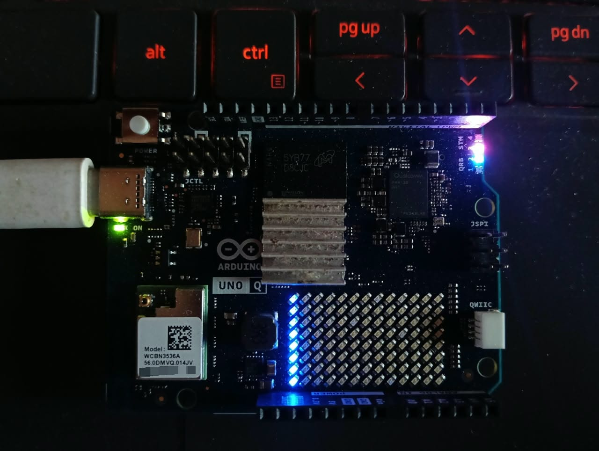

# QFabric

**One program, two computing worlds, and a safer way to recover when timing
changes.**

[](https://pypi.org/project/qfabric/)
[](https://github.com/elixpo/qfabric/actions/workflows/ci.yml)
[](LICENSE)
[](paper/)

<p align="center">
  
</p>

QFabric is a research system for computers that contain both a powerful Linux
processor and a small real-time processor. Instead of permanently deciding
which processor must run a function, a developer describes the timing behavior
the application needs. QFabric measures both sides, detects sustained timing
problems, and can move eligible work at a safe boundary. It then verifies the
new placement and either commits it or rolls back.

The first implementation runs on the **Arduino UNO Q**, combining Debian Linux
with an STM32 microcontroller running Zephyr RTOS.

## Why it exists

Linux is capable and flexible, but its timing can vary under load. A real-time
microcontroller is more predictable, but it has limited memory and compute
capacity. Traditional embedded applications choose between them during
development and keep that choice fixed.

QFabric asks a narrower research question:

> Can a lightweight runtime recover a violated empirical timing contract by
> safely changing where a portable function executes across a Linux–RTOS
> boundary?

Its answer is a measured recovery loop:

```text
observe → detect → check safety → switch → verify → commit or roll back
```

QFabric does not claim hard real-time certification or that adaptation always
beats expert tuning. It provides an evidence-driven fallback when an original
placement stops meeting its measured soft real-time contract.

## What the prototype demonstrates

- The same bounded task can execute on Linux or the real-time MCU.
- Decisions include communication cost, task semantics, and available MCU
  capacity—not execution speed alone.
- Switching waits for a zero-inflight epoch boundary.
- A probation window determines whether to commit or roll back.
- Every recommendation and recovery action has a replayable decision record.
- The onboard LED matrix exposes live runtime state without becoming part of
  the decision policy.

In the controlled four-node load-shift experiment, ordinary Linux reached a
111.30 ms p95 latency and missed 67.3% of 80 ms deadlines. QFabric recovery
reduced p95 to 70.61 ms and misses to 3.7%. A carefully tuned Linux
`SCHED_FIFO` baseline remained faster at 23.91 ms with no misses—an important
boundary on the research claim.

## Try the command-line tools

QFabric supports Python 3.11 and newer:

```bash
python3 -m pip install qfabric
qf --help
```

The package provides analysis, profiling, contract, recommendation, recovery,
decision-history, visualization, instrumentation, and evaluation commands.
Hardware execution additionally requires an Arduino UNO Q flashed with the
matching firmware from this repository.

## Explore the research

| Start here | What it contains |
| --- | --- |
| [Research paper](paper/) | IEEE-style manuscript, bibliography, figures, and build instructions |
| [Stage 11 evaluation](docs/stage-11-evaluation.md) | Final experimental protocol and baselines |
| [Stage 11 findings](docs/stage-11-findings.md) | Results, limitations, and research-question answers |
| [Recovery design](docs/stage-7-recovery.md) | Safe switching, probation, commit, and rollback |
| [Decision evidence](docs/stage-8-decisions.md) | Hash-chained records, explanations, and replay |
| [LED visualization](docs/stage-9-visualization.md) | Physical telemetry grammar and overhead evaluation |
| [Original research plan](https://github.com/elixpo/qfabric/issues/13) | The complete problem framing and staged build plan |

The repository includes raw and processed experimental evidence, independent
stage audits, reproducible paper tables and figures, package artifacts, and
checksum manifests.

## Build and verify

```bash
python3 -m unittest discover -s tests -v
python3 -m compileall -q src tests
make -C paper
```

Hardware-independent checks use the Python standard library. Hardware campaigns
and firmware builds require the UNO Q toolchain described in
[the Stage 1 guide](docs/stage-1.md).

## Authors and citation

QFabric is authored by:

- **Ayushman Bhattacharya** — [ayushman@myceli.ai](mailto:ayushman@myceli.ai)
- **Anwesha Chakraborty** — [anwesha.elixpo@gmail.com](mailto:anwesha.elixpo@gmail.com)

Use [CITATION.cff](CITATION.cff) when citing the software or research artifact.
Versioned releases contain the paper, audited evaluation, package distributions,
manifest, and SHA-256 checksums.

## Licensing and manuscript rights

The QFabric software and non-manuscript project material are licensed under the
[Apache License 2.0](LICENSE).

The unpublished manuscript, its original figures and tables, and the testbed
photograph are **not** licensed under Apache-2.0. They are © 2026 Ayushman
Bhattacharya and Anwesha Chakraborty, All Rights Reserved, under the separate
[manuscript rights notice](paper/LICENSE.md). Citation and personal review are
permitted; republication, adaptation, or redistribution requires written
permission until the authors publish replacement terms.

## Project home

- Repository: <https://github.com/elixpo/qfabric>
- Issues: <https://github.com/elixpo/qfabric/issues>
- Python package: <https://pypi.org/project/qfabric/>

